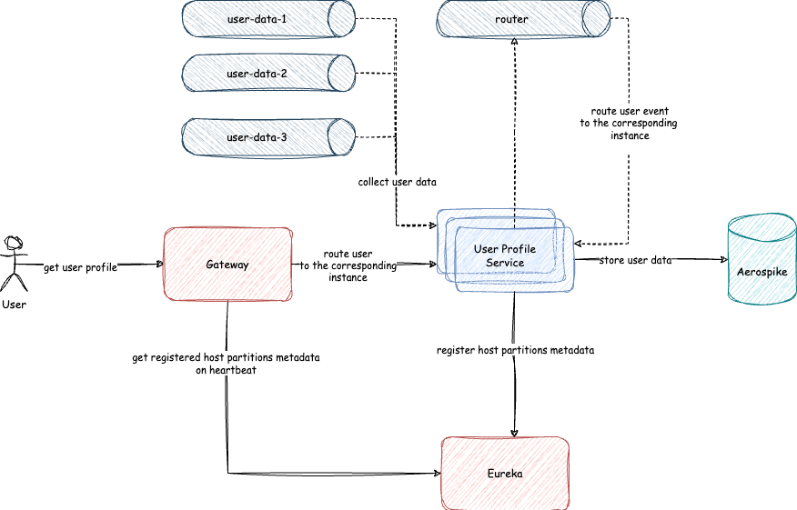

# Sticky routing

This project is a proof-of-concept implementation of sticky routing in a microservices architecture. It ensures that all requests and events related to a specific entity are directed to the same service instance, enhancing cache utilization and making it particularly suitable for low-latency applications.

